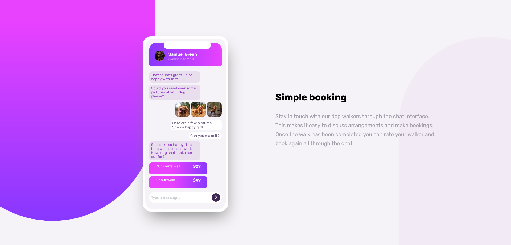

# Frontend Mentor - Chat app CSS illustration solution

This is a solution to the [Chat app CSS illustration challenge on Frontend Mentor](https://www.frontendmentor.io/challenges/chat-app-css-illustration-O5auMkFqY). Frontend Mentor challenges help you improve your coding skills by building realistic projects.

## Table of contents

- [Overview](#overview)
  - [The challenge](#the-challenge)
  - [Screenshot](#screenshot)
  - [Links](#links)
- [My process](#my-process)
  - [Built with](#built-with)
  - [What I learned](#what-i-learned)
  - [Continued development](#continued-development)
  - [Useful resources](#useful-resources)
- [Author](#author)
- [Acknowledgments](#acknowledgments)

## Overview

In this project I learned how to use the "z-index" property and the "animation" property with @keyframes and I am really looking forward to know more about them especially they are largely supported and they can be rerally usefull in many situations. I did the background shapes using divs, which is not the best for responsive design but I tried to play with the medias, I didn't find the need to use SVGs, but if there is a better way to do it or there any other suggestion that would apprecited
any feedback is appreciated too.
Good coding journey for all ;)

### The challenge

Users should be able to:

- View the optimal layout for the component depending on their device's screen size
- See the chat interface animate on the initial load

### Screenshot



### Links

- Solution URL: [Add solution URL here](https://your-solution-url.com)
- Live Site URL: [Add live site URL here](https://your-live-site-url.com)

## My process

### Built with

- Semantic HTML5 markup
- CSS custom properties
- Flexbox
- CSS Grid
- Mobile-first workflow

### What I learned

```css
.proud-of-this-css {
	z-index: ;
}
.proud-of-this-css {
	animation: name duration animation-timing-function;
}
```

### Continued development

I need to work more and discover the world of SVG and become familiar with it even though it is not needed in this project but it might be really useful in other projects especially that it is supported by most of the browesers and it can shorten many tasks.
Also I need to start working with a preprocessor (I ve already chosen SASS) , I'll also try to use the BEM methodology and the utility classes which will definitely provide a CLEAR, ORGANIZED, and SCALABLE code

### Useful resources

- [Youtube](https://www.youtube.com) - Youtube is a very hellpful recources for all developers, I mean you just need to tape your bug or where did you have an issue and a ton of tutorials will appear.
- [Stackoverflow](https://stackoverflow.com/) - This is the place where almost all the developers of the word meet, lot of them have experiences and are willing to help but also lot of them are just looking for help, So it's a great community and great resource for sure.

## Author

- Website - [Njoura7](https://github.com/Njoura7)
- Frontend Mentor - [@Njoura7](https://www.frontendmentor.io/profile/Njoura7)

## Acknowledgments

Those are my heros heroes that I am following right now and who are helping me in almost every single step and project:

### Youtube channels:

[_Kevin Powell_](https://www.youtube.com/kepowob)

[_Web Dev Simplified_](https://www.youtube.com/c/WebDevSimplified)

[_Traversy Media_ ](https://www.youtube.com/c/TraversyMedia)

[_Dave Gray_](https://www.youtube.com/c/DaveGrayTeachesCode)
